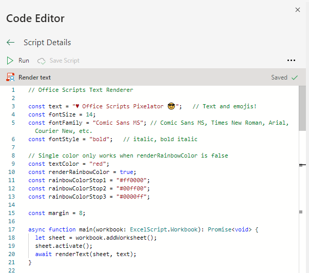

# 

Office Scripts Pixelator is a set of snippets in [Office Scripts](https://aka.ms/office-scripts) that can render (or should I say "*pixelate*") online images or texts (including emojis 😎!) onto Excel worksheet.

> Office Scripts in Excel on the web let you automate your day-to-day tasks. You can record your Excel actions with the Action Recorder, which creates a script. You can also create and edit scripts with the Code Editor. Your scripts can then be shared across your organization so your coworkers can also automate their workflows.

Please refer to <https://aka.ms/office-scripts> for more details about Office Scripts in Excel on the web.

## Features

- Render online images:

  

- Render text (including emojis):

  

- You can copy/paste the rendered images or texts to get some interesting combinations:

  

  

## Usage

- Firstly start from [here](https://aka.ms/office-scripts) to get familiar with Office Scripts in Excel on the web.

- Add a new script in the Office Scripts code editor and replace its content with one of the files on this repo - [renderImage.ts](src/renderImage.ts), [renderText.ts](src/renderText.ts)
  
- Follow the comments in the code to customize what and how you want to render.
  - For images, you can customize:
    - The URL to an online image you want render
    - The size of a "pixel" - the dimension of a single cell
    - Output dimension (`number of columns * number of rows`)
  - For text, you can customize:
    - The text you want to render
    - Font size, family, style, color (single color vs. rainbow color 🌈!)
    - The size of a "pixel" - the dimension of a single cell
- Hit the `▶ Run` button above the code editor.
- The rendering might take a while so take your time.

## Note

- Image rendering is sometimes unstable. If you see the rendering has stopped, you may need to refresh the web page or pick a different image.
- Unfortunately the pixelator code doesn't work with the ["Run script" action in Power Automate](https://docs.microsoft.com/en-us/office/dev/scripts/tutorials/excel-power-automate-manual), yet.
